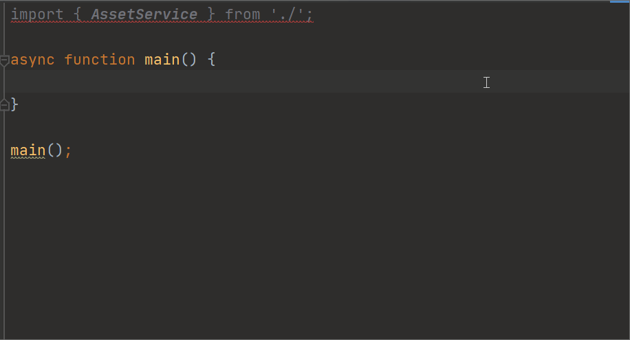

# @mutadev/service

This module provides a serial tools for creating bindings for [Muta service](https://github.com/nervosnetwork/muta-docs/blob/master/service_dev.md).



## Intro Muta Service in 3 Minute

Muta is a Blockchain framework, and the **services** is a layer for customizing business. There are 3 important concept for **service**

- **namespace**: we can define many services in a system, and each service owns its state, for example, `AssetService` for minting tokens, `DexService` for exchanging tokens).
- **read**: we can define many **read** methods in a **service** to get its state
- **write**: we can define many **write** method to mutate its state. Unlike **read**, a successful state change must be consensus, so we need to wait for the receipt

## A Quick Glance

The [AssetService](https://github.com/nervosnetwork/muta/blob/master/built-in-services/asset/src/lib.rs) is a builtin-service in the Muta, this module also offered an [AssetService.ts](./src/builtins/AssetService.ts)

## Customizing Service Binding With TypeScript

### 1. Overview The ServiceMapping

```rust
impl ServiceMapping for DefaultServiceMapping {
    fn get_service<SDK: 'static + ServiceSDK>(
        &self,
        name: &str,
        sdk: SDK,
    ) -> ProtocolResult<Box<dyn Service>> {
        let service = match name {
            // service name
            "asset" => Box::new(AssetService::new(sdk)) as Box<dyn Service>
        }
        ...
}
```

### 2. Overview The Service Definition

```rust
impl AssetService {
    #[read]
    fn get_asset(&self, ctx: ServiceContext, payload: GetAssetPayload) -> ServiceResponse<Asset> {}

    #[write]
    fn create_asset(&mut self, ctx: ServiceContext, payload: CreateAssetPayload) -> ServiceResponse<Asset> {}
}
```

### 3. Mapping The Service To TypeScript

```ts
import { createServiceBindingClass, read, write } from '@mutadev/service';

const AssetService = createServiceBindingClass({
  serviceName: 'asset',
  read: {
    get_asset: read<GetAssetPayload, Asset>(),
  },
  write: {
    create_asset: write<CreateAssetPayload, Asset>(),
  },
});
```

### 4. Overview Types Definition In Muta Service

```rust
pub struct GetAssetPayload {
    pub id: Hash,
}

pub struct Asset {
    pub id:     Hash,
    pub name:   String,
    pub symbol: String,
    pub supply: u64,
    pub issuer: Address,
}

pub struct CreateAssetPayload {
    pub name:   String,
    pub symbol: String,
    pub supply: u64,
}
```

### 5. Mapping Types From Rust To TypeScript

Follow the [types mapping](../muta-types), we could bind the Rust types on TypeScript

```ts
import { Hash, u64, Address } from '@mutadev/types';

interface GetAssetPayload {
  id: Hash;
}

interface Asset {
  id: Hash;
  name: string;
  symbol: string;
  supply: u64;
  issuer: Address;
}

interface CreateAssetPayload {
  name: string;
  symbol: string;
  supply: u64;
}
```

### Finally, Try Our Binding

```ts
import { Client } from '@mutadev/client';
import { Account } from '@mutadev/account';

async function main() {
  const service = new AssetService(new Client(), new Account('0x...'));
  const createdAsset = await service.write.create_asset({
    name: 'MyCoin',
    symbol: 'MC',
    supply: 100000,
  });

  const assetId = createdAsset.response.response.succeedData.id;
  console.log(assetId);

  const asset = await service.get.get_asset({ id: assetId });
  console.log(asset);
}

main();
```

### I Don't Want To Wait For The Receipt

```ts
await service.write.create_asset.composeTransaction();
```

```ts
await service.write.create_asset.sendTransaction();
```
